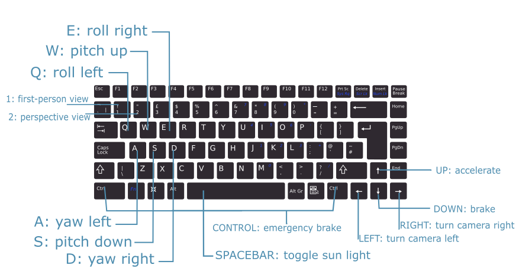
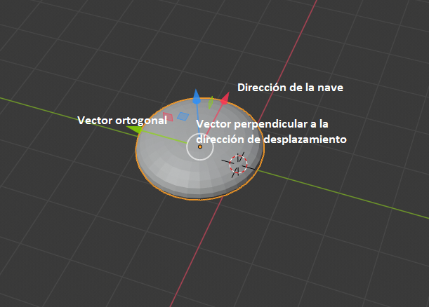

# Planetary system

###### Alberto Ramos Sánchez

<center></center>

En esta práctica hemos realizado el diseño de un sistema de navegación de una nave espacial, que navega por el sistema solar de la práctica anterior.

### Controles

<center></center>


### Vista en primera persona: navegación de la nave.

Para simular el desplazamiento de la nave, tenemos la clase *Spaceship*, que almacena la posición de la nave en cada instante, su velocidad, dirección de desplazamiento (y la perpendicular apuntando hacia el eje y).


###### *Ilustración 1 : vectores que definen la rotación de la nave.*

La nave se desplaza con una velocidad fija, que puede ser ajustada con la flecha superior e inferior del teclado. Con esta velocidad y la dirección de la nave actualizamos la posición de la nave de la siguiente forma:

```java
// update : Spaceship class
this.pos = PVector.add(this.pos, PVector.mult(dir, speed));

```

#### Rotación de la nave

Utilizando los 3 vectores que definen la rotación de la nave *\[Ilustración 1\]* podemos aplicar 3 tipos de giro a la nave: *yaw*, *pitch* y *roll*.

Para aplicar el giro *yaw* o *guiñada*, realizamos la rotación del vector de dirección (rojo) tantos grados como se deseen, sobre el eje definido por el vector perpendicular (azul).

```java
// jaw : Spaceship class
this.dir = RotateU(this.dir, // Direccion de la nave (rojo)
                   this.up, // Vector perpendicular (azul)
                   angle // angulo a rotar la nave
                  );
```

Para aplicar el giro *pitch* o *cabeceo*, rotamos los vectores que definen la dirección (rojo) y el perpendicular (azul) sobre el eje ortogonal a ambos (verde), que calculamos en el momento con el producto escalar de ambos.

```java
// pitch : Spaceship class
PVector perp = perpendicular(this.dir, // Direccion de la nave (rojo)
                             this.up // Vector perpendicular (azul)
                            ); // Aplicamos producto escalar (verde)
this.dir = RotateU(this.dir, // Direccion de la nave (rojo)
                   perp, // Vector ortogonal (verde)
                   angle // angulo a rotar
                  );

this.up = RotateU(this.up, // Vector perpendicular (azul)
                  perp, // Vector ortogonal (verde)
                  angle // angulo a rotar
                 );
```

Finalmente, para aplicar el giro *roll* o *alabeo*, rotamos el vector perpendicular (azul), sobre el eje del vector que marca la dirección de la nave (rojo).

```java
// roll : Spaceship class
this.up = RotateU(this.up, // Vector perpendicular (azul)
                  this.dir, // Direccion de la nave (rojo)
                  angle // angulo a rotar
                 );

```

Cabe notar que las rotaciones no las realizamos sobre los ejes globales de *Processing*, sino sobre los ejes propios de la nave. Lo hacemos de esta forma para que la nave pueda realizar cualquiera de los 3 giros sea cual sea la posición en la que se encuentre. Si lo hicieramos solamente aplicando los giros solamente en los ejes generales, si giraramos por ejemplo, la nave hacia la derecha 90 grados, no podría aplicarse giros de *cabeceo*.

Las rotaciones sobre ejes arbitrarios (definidos por un vector), se realizan con la función *RotateU*

```java
// rotacion.java

PVector RotateU(PVector dir, PVector u, float angle)
{
  PVector n = new PVector(0, 0, 0);

  PVector c1 = new PVector(cos(angle) + u.x*u.x*(1 - cos(angle)),
                           u.y*u.x*(1 - cos(angle)) + u.z*sin(angle),
                           u.z*u.x*(1 - cos(angle)) - u.y*sin(angle)
                          );
  PVector c2 = new PVector(u.x*u.y*(1 - cos(angle)) - u.z*sin(angle),
                           cos(angle) + u.y*u.y*(1 - cos(angle)),
                           u.z*u.y*(1 - cos(angle)) + u.x*sin(angle)
                          );
  PVector c3 = new PVector(u.x*u.z*(1 - cos(angle)) + u.y*sin(angle),
                           u.y*u.z*(1 - cos(angle)) - u.x*sin(angle),
                           cos(angle) + u.z*u.z*(1 - cos(angle))
                          );

  n.x = PVector.dot(dir, c1);
  n.y = PVector.dot(dir, c2);
  n.z = PVector.dot(dir, c3);

  return n;
}

PVector perpendicular(PVector a, PVector b) {
  PVector res = new PVector();
  PVector.cross(a, b, res);
  return res;
}
```

En esta función aplicamos una rotación a un vector *dir*, sobre un eje arbitrario definido por el vector *u*, para ello realizando el producto por la matriz de rotación:


#### Vista en primera persona

Una vez tenemos un mecanismo para aplicar movimiento y giros a la nave, necesitamos aplicar la vista en primera persona desde la nave. Para ello, utilizamos la función *camera* de *Processing*.

Para tener una vista en primera persona desde la nave hacemos que el ojo de la cámara se sitúe en la misma posición de la nave, y que este mire a un punto a una cierta distancia del ojo de la cámara.

Para realizar el movimiento de la cámara, tenemos la clase *Camera*, que almacena los mismos vectores que teníamos para la nave (dirección y el perpendicular apuntando hacia el eje y). Como queremos que la cámara se mueva a la vez con la nave, cuando actualizamos la posición de la nave, actualizamos también la posición de la cámara, y al punto que mira.

```java
// Camera class

public void update(PVector pos, boolean update_data_only) {
  // Punto al que mira la cámara
  this.eye = pos;
  // Calculamos el punto al que mira la cámara desplazando su posición en la dirección a la que mira
  PVector fwd = PVector.add(eye, PVector.mult(this.dir, // Direccion a la que mira la cámara
                                              this.distance)); // Distancia a lo lejos que mira la cámara

  if(!update_data_only)  // En modo primera persona solamente                                       
    camera(eye.x, eye.y, eye.z, // Posición de la cámara, que equivale a la posición de la nave
         fwd.x, fwd.y, fwd.z, // Punto al que mira la cámara
         up.x,  up.y,  up.z // Vector perpendicular, equivalente al vector perpendicular de la nave
         );
}

```

#### Giro de la cámara

Como la dirección a la que apunta la cámara es independiente a dirección a la que se dirige la nave (aunque inicialmente hacemos que sea la misma), podemos también aplicar rotaciones a su dirección.

En el caso de la cámara, solamente aplicamos rotaciones horizontales, para cambiar entre las 4 zonas de la nave (delantera, trasera, izquierda y derecha).

Las rotaciones se aplican igual que haciamos con la nave, pero en este caso, al ser inicialmente iguales en posición y dirección, al rotar el vector que indica la dirección a la que apunta la cámara sin editar el de la nave, conseguimos simular que miramos desde dentro de la nave hacia otras direcciones.

### Vista en perspectiva

El cambio a vista en persectiva se realiza llamando al método *perspective* y, posteriormente, reseteando la cámara a su posición por defecto.

```java
if(Character.toString(key).equals(Integer.toString(PERSPECTIVA))) {
  mode = PERSPECTIVA;
  perspective();

  camera(); // reset camera
}
```

La nave puede seguir siendo controlada, con la limitación de no poder ver el giro de la cámara. La dirección de la nave es indicada por una flecha blanca.

### Head-up-display

La visualización de imágenes y texto en la pantalla de forma que esta no sea ocultada por los objetos 3D o al realizar giros se consigue desactivando el z-buffer y reseteando la cámara:

```java
void displayTextHUD(String str1, float x, float y, color rgb) {
  camera();
  hint(DISABLE_DEPTH_TEST);
  noLights();
  textMode(MODEL);
  stroke(rgb);
  text(str1, x, y);
  hint(ENABLE_DEPTH_TEST);
}

void displayImageHUD(PImage img, float x, float y) {
  camera();
  hint(DISABLE_DEPTH_TEST);
  noLights();
  textMode(MODEL);
  image(img, x, y);
  hint(ENABLE_DEPTH_TEST);
}

```

### Referencias

- Textura de planetas: <http://www.texturesforplanets.com/>
- Textura de estrella: <https://www.solarsystemscope.com/textures/>
- Textura de fondo: <https://wallpaperplay.com/board/blue-space-wallpapers>
- Satélite: <https://free3d.com/3d-model/satellite-v1--384167.html>
- Nombres de objetos: [*His Dark Materials*](https://en.wikipedia.org/wiki/His_Dark_Materials)
- Matriz de rotación sobre eje arbitrario: https://es.wikipedia.org/wiki/Matriz_de_rotaci%C3%B3n
- Nave : https://free3d.com/es/modelo-3d/ufo-saucer-v1--190141.html
- Imágenes vectorizadas del HUD:  
    - Frontal :
      - <a href="https://www.freepik.com/free-photos-vectors/technology">Technology vector created by freepik - www.freepik.com</a>
      - <a href="https://www.vecteezy.com/vector-art/147318-hud-background-and-element-background-set">Science Fiction Vectors by Vecteezy</a>
    - Lateral : <a href="https://www.freepik.es/vector-gratis/futuro-puente-capitanes-nave-espacial-puesto-mando-interior-dibujos-animados_3685433.htm#page=1&query=interior%20nave&position=2">Vector de puesto de mando creado por vectorpouch - www.freepik.es</a>
    - Lateral : <a href="https://www.freepik.es/vector-gratis/futuro-nave-espacial-tripulacion-cabina-futurista-interior-ilustracion-dibujos-animados_3586142.htm#page=1&query=interior%20nave&position=22">Vector de cabina futurista creado por vectorpouch - www.freepik.es</a>
    - Trasera : <a href="https://www.freepik.es/vector-gratis/vista-nave-espacial-tierra-noche-planeta-alienigena_5902277.htm#page=1&query=interior%20nave&position=16">Vector de Vista de la nave espacial en la tierra en la noche del planeta alienígena creado por vectorpouch - www.freepik.es</a>
    - Manual : [Computer black keyboard de vector.me](https://vector.me/download/163350/computer_black_keyboard_compact_hardware_color_grey_colors_technology_qwerty)

 - Imágenes editadas en Inkscape y Adobe Illustrator.
